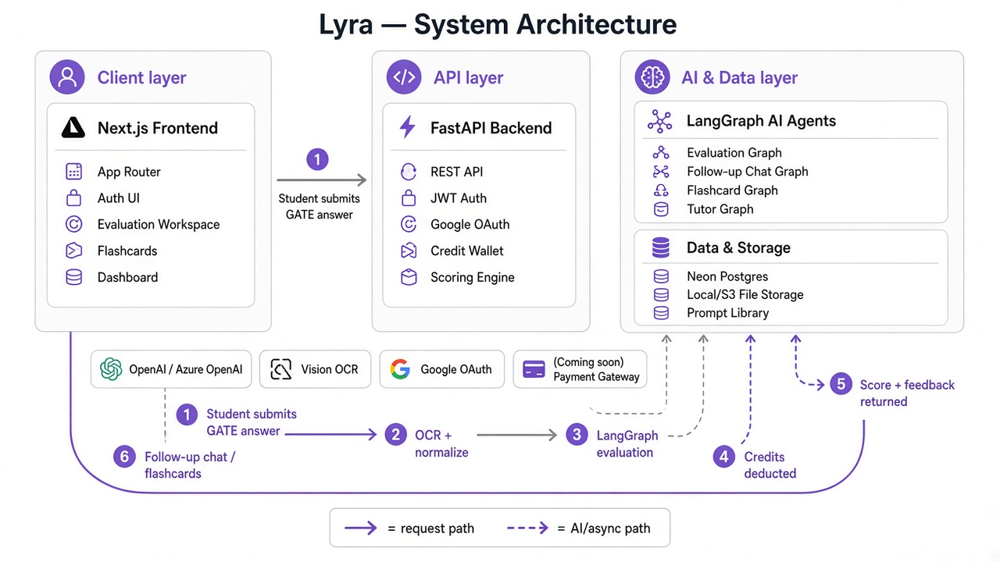

# Qubrix

**AI-powered GATE preparation** — evaluate handwritten and typed answers, get structured feedback, revise with spaced flashcards, and track progress in one loop.

Qubrix starts with **GATE CS / IT** and is built on an exam-agnostic core so additional papers (EE, ME, DA) and exams can be added without rewriting the product.

<p align="center">
  
</p>

<p align="center">
  <em>End-to-end flow: Next.js client → FastAPI → LangGraph agents → Postgres / storage / LLM providers.</em>
</p>

---

## Overview

Qubrix helps aspirants close the gap between “I wrote an answer” and “I know exactly what to fix.”

| Loop stage | What Qubrix does |
|---|---|
| **Submit** | Paste text or upload answer photos (OCR via vision LLM / Azure DI) |
| **Evaluate** | LangGraph pipeline scores, explains gaps, and returns structured feedback |
| **Follow up** | Streamed coach chat on the same attempt (credit-capped) |
| **Revise** | Generate syllabus-aware flashcards with SM-2 spaced repetition |
| **Track** | Dashboard trends, credit wallet, and attempt history |

Credits power AI actions today via an in-app wallet and ledger. **Real payment gateway checkout** (plan catalog already seeded) is next on the roadmap.

---

## Features

### Product

- Landing, email auth, and Google OAuth
- Answer evaluation workspace with history rail, scoring overlay, and follow-up chat
- Custom selects, collapsible sidebars, and mobile drawers for a responsive studio UX
- Flashcard decks with spaced repetition
- Practice / dashboard surfaces for GATE CS topics
- Credit wallet, transaction ledger, and configurable action costs
- Admin overview endpoints
- Stub AI + OCR providers so local demos work before API keys exist

### Platform

- **Frontend:** Next.js App Router, React 19, TypeScript, Tailwind CSS
- **Backend:** FastAPI, SQLAlchemy 2, Pydantic v2, LangChain / LangGraph
- **Data:** Neon Postgres (or any Postgres), local disk or S3 for uploads
- **AI:** OpenAI or Azure OpenAI; OCR via vision LLM or Azure Document Intelligence

---

## System design

The diagram above summarizes the production shape of Qubrix.

1. **Student** submits a GATE answer (text and/or images) from the Next.js evaluation workspace.
2. **FastAPI** authenticates the user, reserves credits, stores uploads, and runs OCR when needed.
3. **LangGraph evaluation graph** normalizes input → structured JSON scoring → validated feedback.
4. Results are persisted; the UI shows score, rubric-style notes, and attempt history.
5. Optional **follow-up graph** streams coaching turns against the same attempt (limited free turns).
6. Learners can spawn **flashcards** / tutor flows from weaknesses and keep revising via SM-2.

| Layer | Responsibility |
|---|---|
| Client | App Router UI, auth screens, evaluation studio, flashcards, dashboard |
| API | JWT + Google OAuth, wallets, scoring config, file storage abstraction |
| Agents | Versioned prompts + graphs: `evaluation`, `followup`, `flashcards`, `tutor` |
| Data | Postgres (users, attempts, credits, decks), object storage for images |
| Providers | Swappable LLM / OCR / storage behind interfaces (`openai`, `azure_*`, `stub`) |

Credits are enforced server-side (`CreditService` + row locks). Costs are not hardcoded in the UI.

---

## Repository layout

```text
lms/
├── frontend/                 # Next.js (App Router, TypeScript)
│   ├── src/app/              # Routes: landing, auth, evaluation, flashcards, …
│   └── src/components/       # App shell, evaluation workspace, UI primitives
├── backend/                  # FastAPI service
│   ├── app/ai/graphs/        # LangGraph agents
│   ├── app/ai/prompts/       # Versioned prompt library
│   ├── app/api/              # HTTP routes
│   └── app/services/         # Credits, evaluations, auth, analytics
└── docs/architecture/        # Architecture assets
```

---

## Quick start

### Prerequisites

- Python 3.11+
- Node.js 20+
- A Postgres database (Neon recommended)

### 1. Backend

```powershell
cd backend
python -m venv .venv
.\.venv\Scripts\activate
pip install -r requirements.txt
copy .env.example .env
# Set DATABASE_URL and secrets in .env
uvicorn app.main:app --reload --port 8000
```

On startup Qubrix creates tables and seeds GATE CS syllabus data, credit costs, and purchase plans.

**Seeded admin (local):** `admin@qubrix.ai` / `ChangeMeAdmin!23`  
Change this password before any shared or production use.

### 2. Frontend

```powershell
cd frontend
copy .env.example .env.local
# NEXT_PUBLIC_API_URL=http://localhost:8000
npm install
npm run dev
```

Open [http://localhost:3000](http://localhost:3000).

### 3. Tests

```powershell
cd backend
pytest
```

---

## Configuration

Brand and environment knobs live in env files so renaming or deploying does not require a code rewrite.

| Area | File | Key examples |
|---|---|---|
| Backend | `backend/.env` | `APP_NAME`, `DATABASE_URL`, `AI_PROVIDER`, `OCR_PROVIDER`, `SECRET_KEY` |
| Frontend | `frontend/.env.local` | `NEXT_PUBLIC_APP_NAME`, `NEXT_PUBLIC_API_URL`, `NEXT_PUBLIC_GOOGLE_AUTH_URL` |

### Providers

| Capability | Options | Notes |
|---|---|---|
| Database | Neon / Postgres | Use `postgresql+psycopg://…` (SQLAlchemy + psycopg3) |
| Auth | Email + Google OAuth | Redirect: `http://localhost:8000/api/auth/google/callback` |
| LLM | `openai` · `azure_openai` · `stub` | Stub returns labelled demo feedback |
| OCR | `vision_llm` · `azure` · `stub` | Vision OCR reuses the OpenAI key when configured |
| Storage | `local` · `s3` | Local disk is fine for development |
| Cache | Redis (optional) | Wired for later jobs/cache; not required for MVP |

Until keys exist:

```env
AI_PROVIDER=stub
OCR_PROVIDER=stub
```

### Google OAuth

Authorized redirect URI for local development:

```text
http://localhost:8000/api/auth/google/callback
```

---

## AI agents

Graphs live under `backend/app/ai/graphs/`:

| Graph | Role |
|---|---|
| `evaluation` | OCR/text normalize → structured evaluation → validate / repair |
| `followup` | Streamed coaching turns bound to an evaluation attempt |
| `flashcards` | Syllabus-aware card generation |
| `tutor` | Mode-conditioned tutoring with conversation history |

Prompts are versioned in `backend/app/ai/prompts/` (for example `evaluation_v1`). Providers implement a shared `AIProvider` interface so OpenAI, Azure, and stub stay interchangeable.

---

## Credits & payments

**Today**

- Starter credits on signup
- Per-action costs (evaluate, follow-up, flashcards, …) in `credit_costs`
- Ledgered wallet with concurrency-safe deductions

**Next**

- Checkout against seeded purchase plans (Starter / Popular / Pro)
- Real payment provider integration (Razorpay / Stripe — TBD)
- Webhook-driven credit top-ups and invoice history

The wallet API and plan catalog are already in place so payments can land without redesigning the credit model.

---

## Product roadmap (near term)

- [x] Evaluation studio + streamed follow-ups
- [x] Flashcards + spaced repetition
- [x] Credit wallet & ledger
- [x] Stub providers for zero-key demos
- [ ] Production payment gateway
- [ ] Deeper analytics and weakness recommendations
- [ ] Additional GATE papers beyond CS/IT

---

## License

Private / unlicensed unless otherwise stated by the repository owner.

---

<p align="center">
  <strong>Qubrix</strong> — write better GATE answers, one evaluation at a time.
</p>
